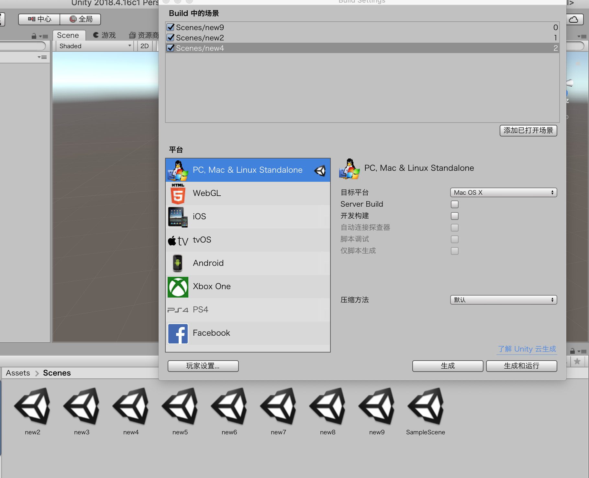
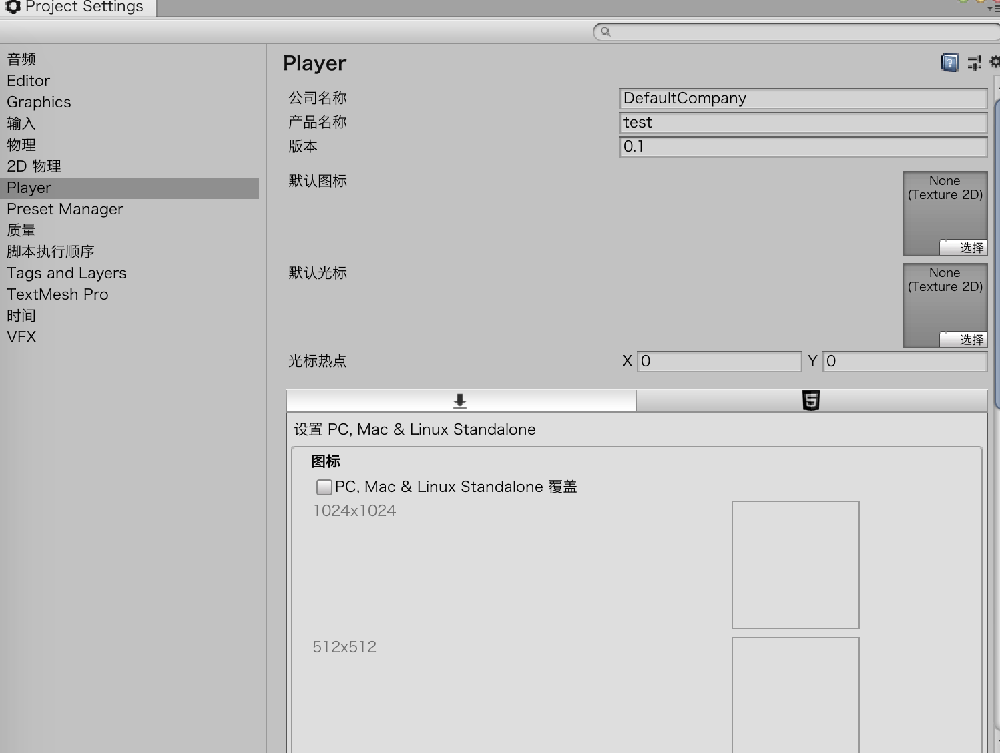

# 优化和部署

## 管理场景

场景背后的思想是：它是游戏对象的集合。因此，当在场景之间转换时，当前场景中的游戏对象都会被销毁，然后创建新的游戏对象。

### 建立场景顺序

在场景之间转换相对比较容易，它只需要一点点设置即可正常工作。首先要做的就是把项目对应的场景添加到项目的编译设置中，如下所示。

* 使用File>Build Settings命令，打开编译设置。
* 在打开的Build Settings对话框中，单击你希望出现在最终项目中的场景，拖曳到Build窗口中



* 注意Build窗口中每个场景旁边的数字，后面我们会用到这个数字。


### 切换场景

想要更改场景，使用方法LoadScene()，它是类SceneManager中的一个方法。为了使用这个类，我们需要告诉Unity你想要访问它，所以需要在要使用它的脚本的顶部添加下面的代码：

```
using UnityEngine.SceneManagement;
```

LoadScene()方法使用了一个参数，它可以是一个表示场景索引的整数也可以是一个用来表示场景名称的字符串。因此，要载入索引为1和名称为Scene2的场景，下面的任意一种写法都可以：

```
SceneManager.LoadScene(1);
SceneManager.LoadScene("Scene4");
```

对于小型项目来说，这种做法比较合适，但是如果我们想要尝试载入一个大型场景，那么场景切换的时间就会比较长，在这段切换的时间内，整个屏幕都将是黑色的。为了避免这种情况的发生，我们可以尝试使用异步（asynchronously）加载场景。这里的“异步（async）”加载的意思是在游戏还在运行的过程中，在后台加载新场景。当新场景加载完毕之后，就会切换场景。这个方法的处理过程不是立即完成的，但是可以帮助我们防止出现游戏卡顿的现象。一般来说，异步加载场景有些复杂，超出了本书介绍的范围。


## 保存数据和对象

毫无疑问，我们也清楚地知道数据不会在场景切换的时候带过去。

在一些更复杂的游戏中，保存数据（通常称为数据的持久化）是一个非常迫切的需求。在本节中，我们将学习如何保存一个场景的对象到另外一个场景中使用，以及如何将数据保存到文件中供后面使用。

### 保存对象

在场景之间保存数据的一种简单的方法是：不销毁带有数据的对象。比如说，一个玩家对象上面有一些脚本，脚本中包含生命、背包、分数等信息，将这么大的数据转移到下一个场景中的最容易的方式是确保它们不会被销毁。有一种简单的方法可以完成这项工作，即使用名为DontDestroyOnLoad()的方法，该方法需要一个参数，参数就是你想保存的游戏对象。因此，如果你想保存一个存储在名为Brick的变量中的游戏对象，可以编写以下代码：

```
DontDestroyOnLoad(Brick);
```

因为这个方法使用一个游戏对象作为参数，另一种在对象自身上调用这个方法的方式是使用this关键字。如果想要保存对象自身，那么可以将下面的代码放到对象所带的脚本的Start()方法中：

```
DontDestroyOnLoad(this);
```

**黑暗的场景**

当切换场景的时候，可能会发现新场景会比较昏暗，虽然新场景中也有光源。这是因为动态载入场景的时候没有完整的灯光数据。

幸好，解决方案很简单：仅需要在Unity中载入场景即可，使用Window>Lighting>Settings命令。不要勾选底部的AutoGenerate，然后点击Generate Lighting。这样Unity就不会为场景使用临时的灯光计算，然后将这些计算提交到资源中。场景旁边就会出现一个文件夹，与场景具有相同的名字。之后，载入场景的时候，灯光就会正常显示。


### 保存数据

有的时候，你需要将数据保存到一个文件中，之后再访问它。要保存的数据可能有玩家的分数，配置偏好或者仓库数据。有很多复杂并且功能强大的方法来保存数据，但是一个最简单的解决方案是使用PlayerPrefs。PlayerPrefs是一个对象，它用于将基础数据保存到一个本地的文件系统中。之后，再使用PlayerPrefs将数据读出来。

```
企业.SetInt("score",10);
PlayerPrefs.GetInt("score");
```

还有用来保存字符串的方法SettingString()和保存浮点数的方法SetFloats()。使用这些方法，我们可以轻松地将任何数据保存到文件中。


## Unity玩家设置

这些设置称为玩家设置，它们用于管理像游戏图标和所支持的屏幕宽高比这样的设置。设置有很多种，其中很多设置都是自解释的。如果使用Edit>Project Settings>Player命令，就会在Inspector视图中打开Player Settings窗口

### 跨平台设置

首先我们会看到跨平台设置（见图23-3）。无论为哪个平台（Windows、iOS、Android、Mac等）构建游戏，这些设置都通用。本节涉及的设置基本上都是自解释的。产品的名称是显示在游戏标题上的名字。这个图标可以是任意有效的纹理图片文件。注意图标的尺寸必须是2的幂次方，比如说8×8，16×16，32×32，64×64等等。如果图标不满足2的幂次方的尺寸，那么图标将无法正常缩放，而且图片质量也会很低。我们还可以指定一个自定义的光标，并定义光标的热点位置（光标的热点位置指的是“点击”的地方）。



### 各个平台的设置

这里面很多设置都要求了解要构建的平台。如果不是特别了解某个设置对平台的影响，那么就不要修改这个设置。还有一些设置的功能特别明确，只有想达成一个特定目标的时候才需要修改这个目标。比如说，Resolution和Presentation设置用于处理游戏窗口的尺寸。对于构建桌面游戏来说，可以选择窗口化或者全屏，还有很多宽高比可以选择。启用或者禁用不同的宽高比，就可以让玩家在玩游戏的时候选择不同的分辨率。


## 构建游戏

### 构建设置

构建设置窗口包含游戏构建需要的术语。在这个窗口中，我们可以指定游戏运行的平台以及游戏中使用的各种场景。之前我们已经见过这个窗口，但是现在我们需要仔细查看这个窗口中的设置。打开Build Settings窗口，使用File>Build Settings。在Build Settings对话框中，我们可以更改并配置想要的游戏。

## 其他

资源

* http://www.gamasutra.com

* http://www.gamedev.net

