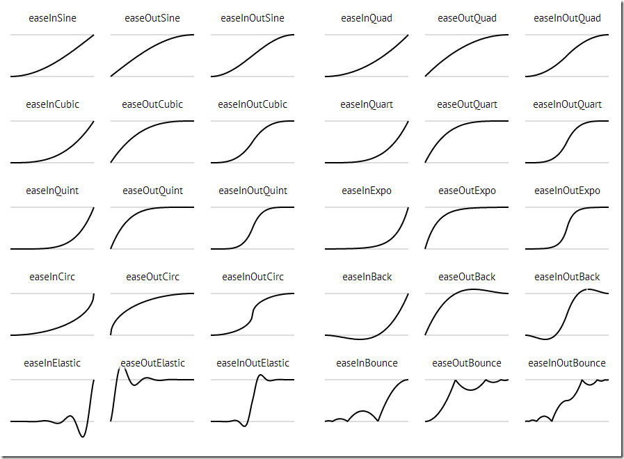

# Unity iTween插件详解

iTween是一个动画库,作者创建它的目的就是最小的投入实现最大的产出.让你做开发更轻松,用它可以轻松实现各种动画,晃动,旋转,移动,褪色,上色,控制音频等等 到官网看看

## 示例

```c#
void Start()
    {
        iTween.RotateFrom(gameObject, iTween.Hash("y", 90.0f, "time", 2.0f, "easetype", iTween.EaseType.easeInExpo));
        iTween.MoveFrom(gameObject, iTween.Hash("y", 3.5f, "time", 2.0f, "easetype", iTween.EaseType.easeInExpo));
        iTween.ShakePosition(Camera.main.gameObject, iTween.Hash("y", 0.3f, "time", 0.8f, "delay", 2.0f));
        iTween.ColorTo(gameObject, iTween.Hash("r", 1.0f, "g", 0.5f, "b", 0.4f, "delay", 1.5f, "time", 0.3f));
        iTween.ScaleTo(gameObject, iTween.Hash("y", 1.75f, "delay", 2.8f, "time", 2.0f));
        iTween.RotateBy(gameObject, iTween.Hash("x", 0.5f, "delay", 4.4f));
        iTween.MoveTo(gameObject, iTween.Hash("y", 1.5f, "delay", 5.8f));
        iTween.MoveTo(gameObject, iTween.Hash("y", 0.5f, "delay", 7.0f, "easetype", iTween.EaseType.easeInExpo));
        iTween.ScaleTo(gameObject, iTween.Hash("y", 1.0f, "delay", 7.0f));
        iTween.ShakePosition(Camera.main.gameObject, iTween.Hash("y", 0.3f, "time", 0.8f, "delay", 8.0f));
        iTween.ColorTo(gameObject, iTween.Hash("r", 0.165f, "g", 0.498f, "b", 0.729f, "delay", 8.5f, "time", 0.5f));

        iTween.CameraFadeAdd();
        iTween.CameraFadeTo(iTween.Hash("amount", 1.0f, "time", 2.0f, "delay", 10.0f));
    }
```


## EaseType

* none:不循环
* loop:退回然后重新开始
* pingPing：来回摆动播放


## Tween曲线

```c#
"easetype", iTween.EaseType.easeInExpo
```



## 示例二

```c#
public class iTweenController : MonoBehaviour
{
    int clbkN = 0;
    GUIStyle style;

    void Awake()
    {
        style = new GUIStyle();
        style.fontSize = 60;
    }

    void Start()
    {
        iTween.MoveTo(gameObject, iTween.Hash("position", new Vector3(5.0f, 1.0f, 0.0f), "oncomplete", "myClbk",
            "loopType", iTween.LoopType.loop, "speed", 2.0f));
    }

    void myClbk()
    {
        clbkN++;
    }

    void OnGUI()
    {
        GUI.Label(new Rect(10, 10, 0, 0), "Callback # "+clbkN, style);
    }
}
```

