# Animator

## Animator的基本知识

Unity的动画系统（Mecanim）主要由三部分组成：动画片段、Animator控制器以及Animator组件。这三部分的存在让角色栩栩如生。

### 导入模型

```
Assets>Import Pacage>Characters
```

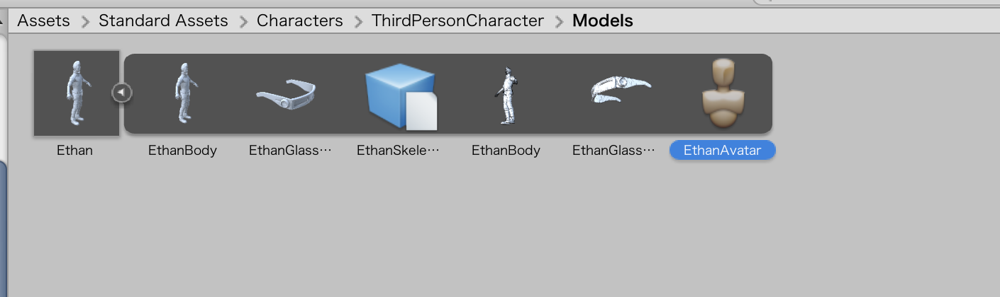

如果点击Ethan文件右侧的小箭头，就可以展开这个模型查看所有的组成部分。这些部分如何构建依赖于制作模型时使用的3D软件的导出设置。这些组件从左到右依次是：Ethan带有纹理的躯干、纹理化的眼睛、骨骼的定义、EthanBody的网格、EthanGlasses的网格、最后是Ethan's的avatar（用于rigging）。


## 配置资源

### rig准备

在导入设置中，我们可配置模型的rig，这些配置在Inspector视图的Rig选项卡中。这些属性中，我们最关心的是Animation Type。下拉框中有四种类型可以使用：None、Legacy、Generic和Humanoid。

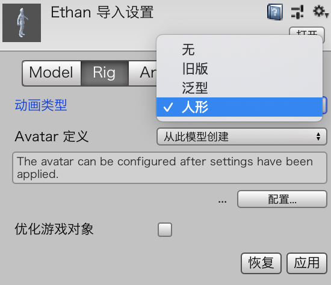

将这个属性设置为None会让Unity忽略模型的rig。Legacy用于Unity的旧动画系统，现在不要再使用它。Generic可以用于所有非人形的模型（比如说简单的模型、交通工具、建筑、动物等），所有Unity导入的模型默认情况下都是这个类型。

最后Humanoid（我们将会使用的类型）用于所有的人形角色。这个设置允许Unity为你重定向动画。

* 如果还没有导入标准资源包中的资源，那么创建一个新项目，然后从Standard Assets中导入角色资源。找到Ethan.fbx这个资源，然后选中它，像之前介绍的那样在Inspector视图中查看导入设置。
* 在Rig选项卡中点击Configure。这样做会启动一个新场景，所以提示保存的时候注意将旧项目保存一下。
* 重新排列Unity的界面，让Hierarchy视图和Inspector视图显示在主要的位置（在第1章中，我们已经介绍了如何关闭和移动选项卡）。我们也可以保存这个布局，因为后面我们总要回到Default的布局。
* 选中Mapping选项卡，点击绿色的圆圈。注意Hierarchy视图如何高亮显示EthanSkeleton对应的子对象，然后将蓝色的圆圈显示在骨骼轮廓的下面。注意rig所有额外的点都在Hierarchy视图。它们对于人形模型来说并不重要，也不会被重定向。不过也不用担心，它们在模型中还是有一定的作用，比如说在移动的时候让模型看起来更正常。

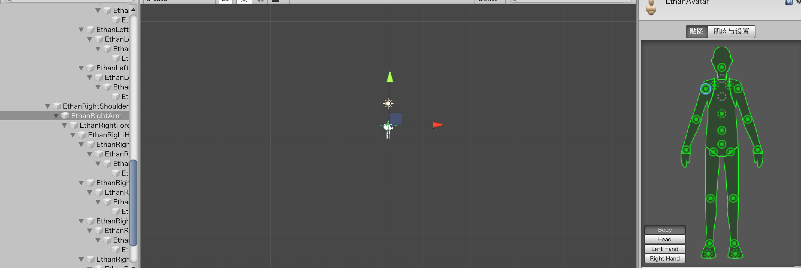

* 选中Body、Head、Left Hand等来继续探索身体上的其他部分。这些都是joints，它们可以被重定向到任何人形模型上。
* 当你完成后，点击Done按钮。注意Hierarchy视图中临时的Ethan（Clone）会消失不见。

此时，你已经提前预览了Ethan，看到骨骼是如何被重新排列的。现在这个模型已经准备好运动了。


### 动画准备

首先将Animations文件夹从本书的资源文件夹中拖到Unity的编辑器中。然后，我们将要处理四个动画：Idle、WalkForwardStraight、WalkForwardTurnRight和WalkForward-TurnLeft（虽然Animations文件夹仅包含三个文件，但马上就会看到更多的文件）。每个动画都需要单独设置。如果查看Animations文件夹，你会看到这些动画实际上都是.fbx文件。这是因为动画本身都在默认的模型中。不要慌，你可以在Unity中修改并导出动画。

* 在Animations文件夹中选中Idles.fbx文件。在Inspector视图中切换到Rig选项卡。把动画类型改为Humanoid，然后点击Apply按钮。这个操作会告诉Unity这个动画是用于人形模型。
* 一旦配置了rig，就可以点击Inspector中的Animations选项卡。将开始的帧设置为128，然后勾选Loop Time和Loop Pose。除此之外，还要为所有的Root Transform属性勾选Bake into Pose选项。确保你的设置与如图所示的相同，然后点击Apply。

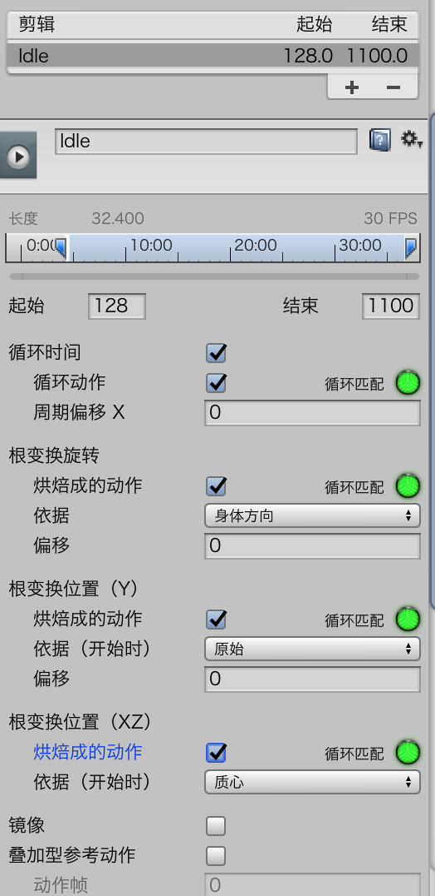

* 要想确认动画本身现在是否被合理配置，请展开Idles.fbx文件。一定要记住如何访问那个动画（模型本身没有关系，重要的是我们想要的动画）。

可能你已经注意到了动画设置中的绿色圆圈（如上图所示）。它们是非常实用的小工具，用于指定动画是否已经排列好。绿色的圆圈表示动画将无缝循环。黄色的圆圈表示动画接近于无缝地循环，但是有小缺陷导致没有完全实现无缝循环。

### WalkForwardStraight Animation

为了配置WarkForwardStraight动画，请按照下面的步骤操作：

* 在Animation文件夹中选中WalkForward.fbx文件，然后像Idle动画一样完成rigging操作。
* 将动画片段当前的名称改为WarkForwardStraight，右键点击原始的名字就可以进行改名操作
* 在Animations选项卡下，你应该注意两件事：第一，Root Transform Position(XZ)旁边具有一个红色圆圈，这很好。它意味着在动画末尾，模型处于不同的x轴和z轴位置。由于这是一个行走的动画，所以这就是你想要的行为。另一件需要注意的事是Average Velocity指示器，应该注意到x轴和y轴都是非零的速度。其中z轴的速度是合理的，因为你希望模型向前移动，但是x轴具有非零的速度是错误的，因为它会让模型在行走的时候横向偏移，所以我们需要在第4步中调整这个设置。
* 调整x轴的速度，勾选Root Transform Rotation和Root Transform Position(Y)的Bake into Pose选项。还要更改Root Transform Rotation Offset的值，将AverageVelocity的x轴的值改为0。
* 将最后一帧设置为244.9，然后将第一帧设置为215.2，这样动画就只包含行走帧了。
* 最后，勾选Loop Time和Loop Pose。
* 确保最终的设置与图18-9中的设置一样，然后点击Apply按钮。

### WalkForwardTurnRight动画

* 在Animations文件夹中选中WalkForwardTurns.fbx文件，然后按照制作Idle动画的方式完成rigging操作。
* 默认情况下会看到一个很长的动画，名字为_7_aU1_M_P_WalkForwardTurnRight。在Clip Name文本框中输入WarlkForwardTurnRight对它重命名，然后按下Enter键。
* 选中WalkForwardTurnRight动画片段，然后将它的属性设置为图18-10中所示的那样。缩短的Start和End时间间隔将会截断动画，保证它只包含一个向右行走的循环（请确保先进行预览，查看它是否如我们想象那样）。完成之后，点击Apply。
* 在Clips列表（见图18-11）中点击+图标，创建一个WalkForwardTurnLeft的动画片段。WalkForwardTurnLeft动画片段与WalkForwardTurnRight动画片段基本一致，除了需要勾选Mirror属性（见图18-11）。记住，当完成设置的时候，点击Apply按钮。

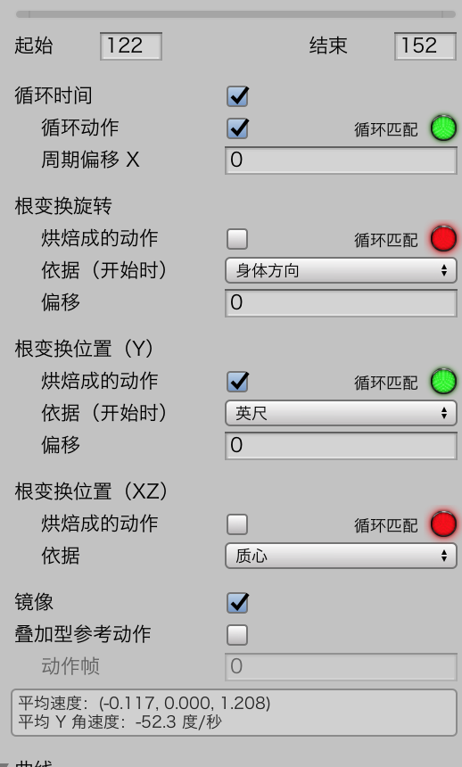


## 创建一个Animator

* 如果你现在还没有完成，那么先创建一个新项目，然后完成本章前面介绍的模型和动画。
* 将Ethan模型拖入场景（在Assets\StandardAssets\Characters\ThirdPersonCharacter\Models下），然后将它的位置设置于（0,0,–5）。
* 将Main Camera拖到Ethan下作为它的子节点（在Hierarchy视图中，拖动Main Camera对象到Ethan游戏对象上），然后将摄像机的位置设置为（0,1.5,–1.5）。
* 在Project视图中，创建一个新文件夹，命名为Animators。右键单击新的文件夹，然后选择Create>Animator Controller。将animator命名为PlayerAnimator。在场景中选中Ethan，然后将动画器拖动到Inspector中Animator组件的Controller属性上。

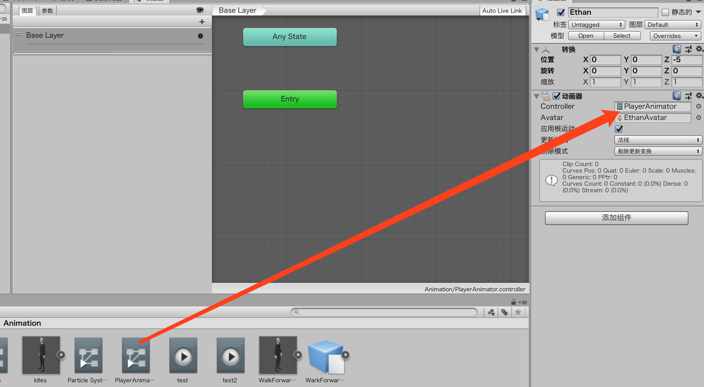

* 在场景中添加一个平面。将平面放在（0,0,–5）的位置，缩放大小设置为（10,1,10）。
* 在随书资源的Hour 18中找到Checker.tga文件，然后将它导入到项目中。创建一个新的材质，命名为Checker，然后将Checker.tga作为albedo的材质（见图18-13）。

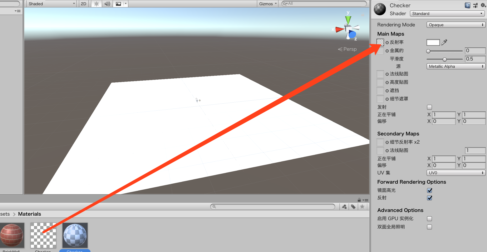

* 将Tiling属性的X和Y都设置为10，然后将材质应用于平板（现在平板还不是很有用，但是它在本章后面的作用很大）。

### Animator视图

这个视图的功能类似一个流程图，它能让你可视化创建动画路径和绑定。这就是Mecanim系统的真正实力。

### Idle动画

我们只需要找到Idle动画片段，它在Idles.fbx文件中（参考本章前面的图18-7），然后将它拖曳到Animator视图上（见图18-15）。

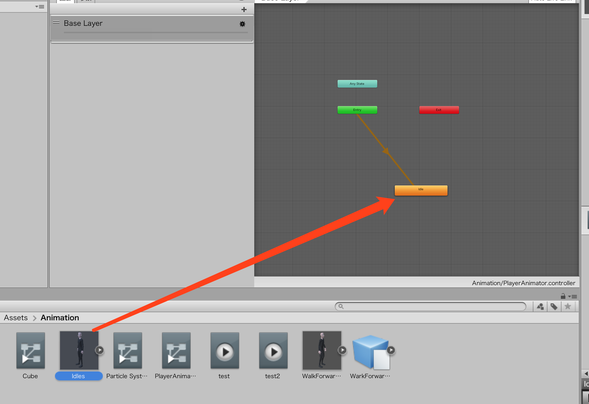

现在我们运行场景，会发现Ethan模型开始循环播放Idle动画。

> 当你运行场景，查看Ethan模型播放休闲动画的时候，可能会发现模型的脚会在地面上打滑。这是因为动画是授权式的。在这个动画中，角色的移动取决于角色的臀部与脚步之间的对照（导致看起来像纸风车在旋转）。我们可以在Animator视图中修整这个问题。选中Idle动画这个状态，然后在Inspector视图中，选中Foot IK复选框（见图18-16）。模型现在的脚开始着地了。这样会让角色的休闲动画正确播放，双脚紧紧贴地。顺便说一句，IK的意思是Inverse Kinematics；更多的细节内容就不在本文的考虑范围之内了。

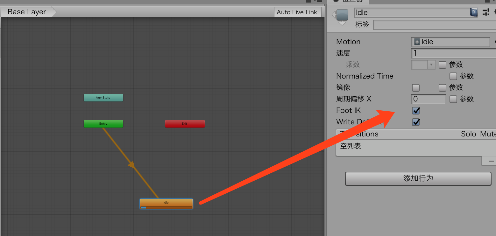


### 参数

* 确保完成了本练习之前的所有练习。
* 在Animator视图中，点击左边的Parameters选项卡，然后点击+号创建一个新的参数。选择一个Float参数，然后将它命名为Speed
* 重复步骤2，然后再创建一个名为Direction的float参数。


### 状态和混合树

Ethan这个模型有两个状态：Idle和Walking。Idle状态已经就位。因为Walking状态对应三种动画，所以我们需要创建一个使用了混合树（Blend Tree）的状态，它会让一个或者多个动画基于某些参数无缝绑定。为了创建一个新的状态，请按照下面的步骤操作：

* 在Animator视图中右键单击Animator视图的空白点，然后使用Create State>From New Blend Tree。在Inspector视图中，将这个新状态命名为Walking
* 双击新状态就可以展开它，然后选中新建的Blend Tree状态。在Inspector中，点击Parameter属性下拉框，然后将它更改为Direction。之后点击motions下面的+并选中Add Motion Field添加三个动作。在这张图中，将最小值设置为–1，将最大值设置为1

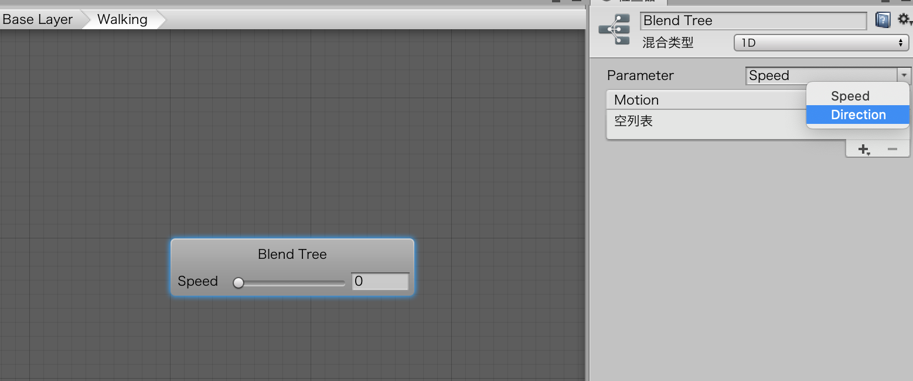

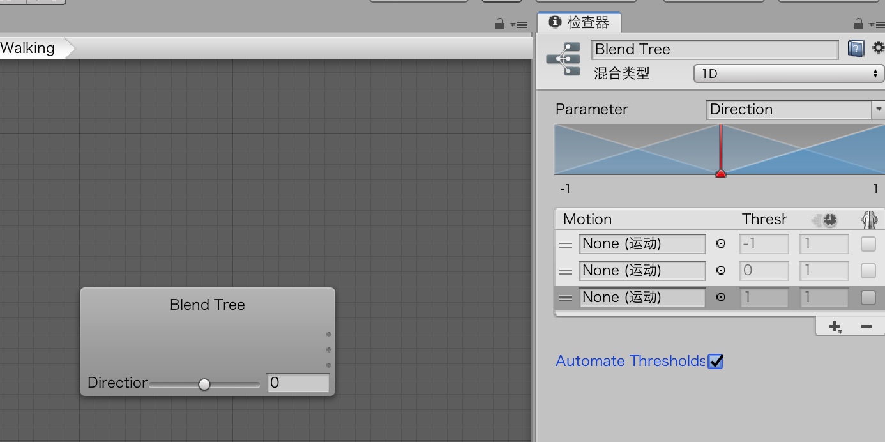

* 按照WalkForwardTurnLeft、WalkForwardStraight、WalkForwardTurnRight的顺序将每个行走动画拖动到对应的动作栏中（见图18-20）。转身动画片段在WalkForwardTurns.fbx中，向前走的动画在WalkForward.fbx中。

现在我们已经准备好基于方向参数制作动画混合。一般来说，需要告诉混合状态类计算参数Direction。基于参数值，混合树将会选择每个动画一定的百分比片段混合到一起制作出最终的动画。比如说Direction参数设置为–1，那么混合树将会播放WalkForwardTurnLeft动画的全部内容。如果Direction等于0.5，那么混合树将会播放50%的WalkForwardStraight动画和50%的WalkForwardTurnRight动画。我们可以很容易发现混合树的强大之处！如果先退出展开的视图，可以点击Animator视图上方的Base Layer


### 过渡

需要做的最后一件事是：确保在animator完成时告诉animator如何在Idle动画与Walking动画之间进行过渡。你需要设置两种过渡：一种是让动画器从休闲过渡到步行，另一种则是相反的过渡。要创建过渡，可以按照下面的步骤操作：

* 右键单击Idle状态，然后选择Make Transition，创建一条跟随鼠标移动的白线。点击Walking状态，这样就可以将两种状态连接起来。
* 重复第1步，只不过这次是把Walking状态连接到Idle状态。
* 单击Idle到Walking的过渡上面的箭头就可以执行编辑操作。添加一个条件，并将条件的Speed Greater的值设置为0.1（见图18-22）。对Walking到Idle的过渡执行相同的操作，只不过把条件设置中的Speed Less Than设置为0.1。
* 不要勾选Has Exit Time选项框，这样当按下行走键的时候，Idle动画就可被打断。


## 编写Animator的脚本

现在我们已经设置好了模型、绑定、动画、animator、过渡和混合树，最后我们要让整体具有交互性。

* 创建一个名为Scripts的文件夹，然后添加一个新脚本。将这个脚本命名为AnimationControl。在场景中，将脚本绑定到Ethan模型中（这一步非常关键）。
* 在AnimationControl脚本中添加如下代码
* 运行场景，然后注意动画由垂直和水平轴控制（如果忘记了，这里提示一下：水平轴和垂直轴控制的快捷键是WASD键和方向键）。

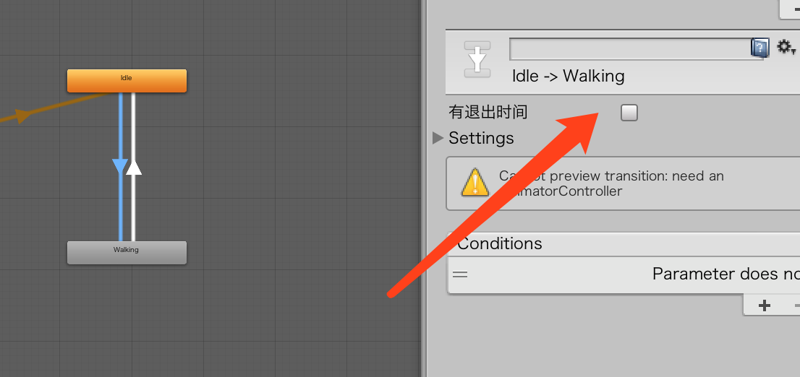

这个一定要取消掉，否则游戏运行无法行走。

