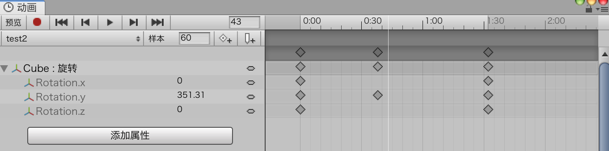

# 动画

动画是提前做好的可视化动作集合。在2D游戏中，动画将多幅顺序的图像按顺序迅速切换，看起来就像是对象在移动（这种效果类似于之前的连环画）。3D世界里的动画与2D动画有很大的差别。在3D游戏中，我们使用模型来表示游戏实体，所以不能简单地通过切换模型来表现运动。

## 动画的基础知识

### 绑定

为了实现复杂的动画动作比如行走，不使用rig是不可能的（或者说非常困难）。如果没有rig，计算机无法知道模型的哪一部分需要移动以及它们如何移动。所以rig是什么？它很像人类的骨骼，一个rig就表示模型中刚性的部分，通常称为骨骼（bone）。它还指出了哪一部分可以弯曲，这些可以弯曲的部分称为关节（joint）。

### 动画

一旦模型有了rig（如果是简单的对象则不需要rig），就可以为它制作一个动画。从技术层面上讲，动画只是一系列用于属性或者rig的指令。这些指令可以像电影一样播放，甚至可以暂停、单步调试或翻转

## 动画类型

### 2D动画

从某种意义上说，2D动画是最简单的动画类型。就像本章前面介绍的那样，2D动画的工作原理很像翻页书（或者动画片，甚至像是基于胶卷的电影）。2D动画背后的思想就是用一种非常快的速度顺序播放一组图片，从而欺骗眼睛，让我们觉得图像动起来了。

### 创建动画

现在已经准备好了资源，可以开始将它们转化为动画。完成这个工作有一种简单的方法，也有一种复杂的方法。复杂的方法包括创建一个动画资源，制定精灵渲染属性，添加关键帧，并提供值。因为你还没有学习如何操作（本节后面会学），所以让我们先进行一个简单的操作。Unity包含一套强大的自动化工作流，之后我们将使用这套流程创建动画。

## 动画工具

### 动画窗口

为了开始使用Unity的动画工具，你需要打开Animation窗口，使用Windows>Animation（不是Animator）命令。它会打开一个新的视图，然后就可以调整大小并像Unity中的其他窗口一样停靠。一般来说，最好将这个窗口停靠在Unity上，这样在使用Unity的时候就不会与其他窗口发生重叠。

### 创建一个新的动画

* 创建一个3D项目。
* 在场景中添加一个立方体，请放在（0,0,0）的位置。
* 打开Animation窗口（使用Window>Animation命令），然后将它停靠在编辑器中。
* 选中立方体，然后在Animation视图的中间靠右会看到一个Create按钮，点击这个按钮，然后会弹出保存动画的提示，保存动画并将它命名为ObjectSpinAnim
* 在Animation视图中点击Add Property按钮，然后点击Transform>Rotation旁边的+号。 添加Rotation属性现在动画中已经有了两个关键帧：一个是第0帧，另外一帧是第60帧（或者说“1秒”，从下面的提示信息中可以看到更多关于时间轴的信息）。如果展开Rotation属性，你可以看到各个轴的属性。然后，选中一个关键帧可以调整这个关键帧的值。

