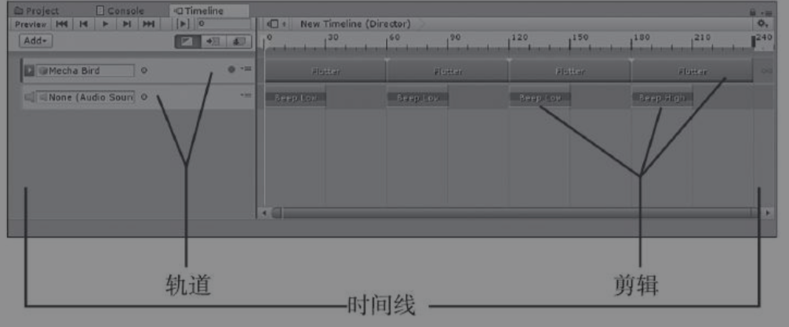
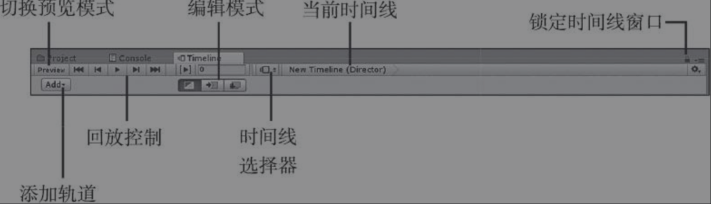
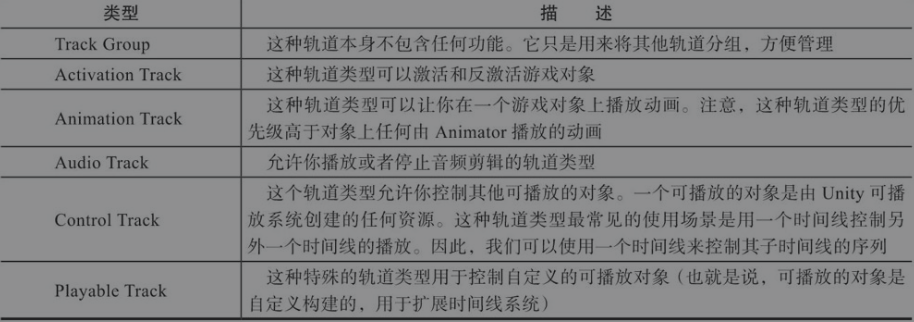
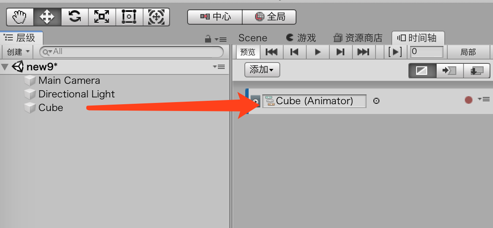
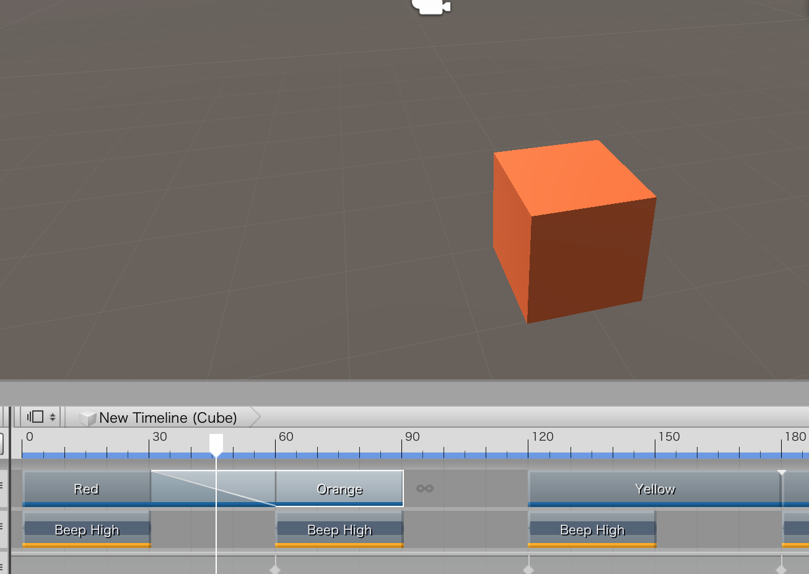

# 时间线

时间线timeline是Unity强大的序列化工具

## 基础知识

animator控制器用于序列化动画，并控制在对象上播放哪个动画。

但是他无法完成以下动作，两个侍卫在交谈，一个小偷在后边溜过去。这就是时间线的工作。

### 剖析时间线



### 创建时间线

```
Create>Timeline
```

一旦创建了时间线，它就需要受Playable Director组件的控制，这个组件会添加到场景中的一个游戏对象上。要想在一个游戏对象上添加一个Playable Director组件，我们可以选中这个对象，然后点击

```
AddComponent>Playables>Playable Director
```

然后，需要将时间线资源作为Playable Director的Playable属性。

> 还有一种更简单的方法可以一次性完成上述两个步骤：将时间线资源从Project视图直接拖到Hierarchy视图中用于控制时间线的游戏对象上


## 使用时间线

时间线本身无法完成任何工作，所以需要创建轨道和剪辑。

### 时间线窗口



> 当我们使用时间线窗口的时候，会经常点击Scene或者Project窗口中的其他对象。当我们这样做的时候，会发现如果取消选择Director游戏对象，那么时间线窗口会变空。这样会令人很恼火。所以，使用时间线窗口的时候最好将它锁定

**Preview模式**

> 当处于Preview模式的时候，有一些功能会被禁用。比如说，无法应用任何预设的更改。如果你发现某些对象的行为不正确，那么请尝试离开Preview模式，然后确保时间线窗口没有影响到场景中的对象。


### 时间线轨道

**轨道类型**



* 打开在上一个“动手做”练习中创建的场景，在场景中添加一个立方体，然后将它放在（0,0,0）的位置。
* 打开时间线窗口（使用Window>Timeline命令）。在场景中选中Director游戏对象。我们将会在时间线窗口中看到时间线（虽然现在时间线上还没有任何轨道线）。
* 点击右上角的锁图标锁定时间线窗口（参见图19-4）。
* 点击Add按钮，然后选中Animation Track，添加一个新的动画轨道线。
* 从Hierarchy视图中将Cube对象拖动到时间线窗口的Track Binding属性上，完成将Cube游戏对象绑定到动画轨道上的操作。



* 当出现提示的时候，点击Create Animator onCube。
* 点击Add按钮，然后选中Audio Track添加音频轨道线。音频轨道线的功能实现不需要绑定到游戏对象上。


### 时间线剪辑

要想在轨道线上添加剪辑，只需要点击一条轨道线，然后选中AddFrom<type of clip>。

* 打开之前练习中创建的场景，找到随书资源中的Animations和Audio两个文件夹并将其导入项目中。
* 在时间线窗口中，右键单击动画轨道绑定到Cube游戏对象，然后选择Add from Animation Clip。
* 在弹出的Select AnimationClip对话框中，选择新导入的Red动画剪辑。
* 重复第三步，添加Orange、Yellow、Green、Blue、Indigo和Violet（见图19-7）。
* 右键单击音频轨道，然后选择Add from Audio Clip命令。然后选择Beep High音频剪辑。
* 通过按下Ctrl+D或者在Mac上按下Command+D在音频轨道上复制Beep High剪辑六次。
* 移动音频剪辑，然后随着时间的变化，立方体的颜色也会跟着变化。
* 移动scrubber或者点击时间线窗口中的Play按钮就可以预览动画。注意音频无法提前预览（Unity的下个版本会增加预览功能）。保存场景然后播放。注意立方体的颜色会随着音频剪辑的变化而变化。

> 时间线窗口中的每个轨道都可以被锁定，以防意外操作产生的更改。我们只需要选中一条轨道线，然后按下L键，或者右键单击选择Lock功能。除此之外，轨道还可以实现静默功能，这样当时间线播放的时候，轨道线就不会播放了。想要让一条轨道静默，那么可以选中它，然后按下M键或者右键点击并选择Mute。


## 复杂的控制

### 在轨道上混合剪辑

实际上，可以使用一个时间线绑定两个不同的剪辑来创建一个新的结果。我们只需要将一个剪辑拖动到另外一个剪辑上即可。比如说图19-9，显示了“序列化剪辑”中将Red和Orange剪辑混合在一起的结果。




### 针对时间线编程

为了编写时间线系统可以使用的代码，需要告诉Unity使用Playables库：

```
using UnityEngine.Playables;
```

然后创建一个类型为PlayableDirector的变量，使用它控制时间线。有两个主要的方法：Play()和Stop()。

```
PlayableDirector director = GetComponent<PlayableDirector>();

director.play();
director.stop();
```

另外一件可以完成的工作是告诉Director运行的时候播放什么动画。这个功能的一个潜在使用场景是：当拥有多个时间线的时候，可以随机选择或者根据游戏进程决定播放哪一个时间线：

```
public PlayableAsset newTimeline;

void SomeMethod(){
	director.Play(newTimeline);
}
```

* 打开上一个“动手做”练习中创建的场景，然后添加一个名为Scripts的文件夹，在文件夹中添加一个名为InputControl的脚本。
* 选中Director游戏对象，然后不要勾选PlayableDirector组件上的Play on Awake。将InputControl脚本附加到Director游戏对象上，然后像下面一样修改代码：
* 运行场景，现在当你按下空格键的时候，就可以控制时间线的开启或者关闭。


## 其他

