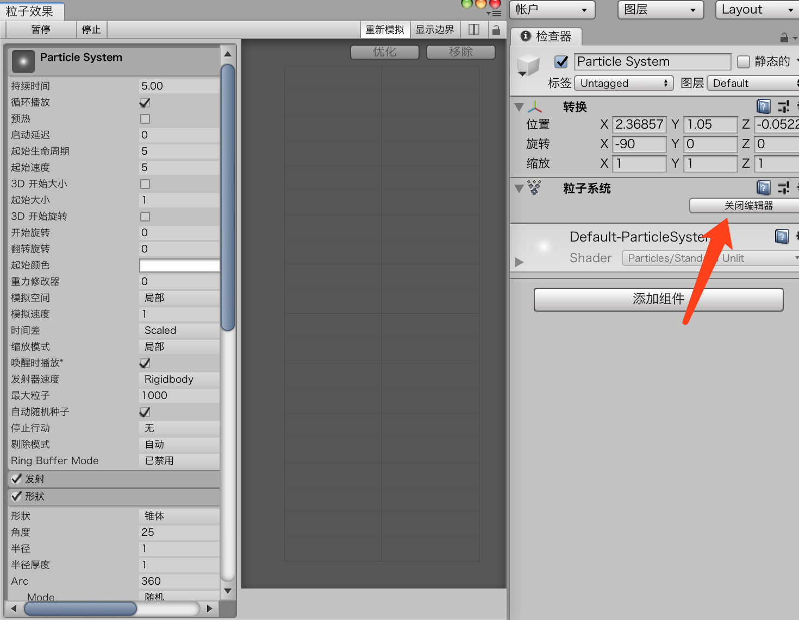

# 粒子系统

## 粒子系统的基本知识

粒子效果Particles Effects

大多数粒子都使用2D billboard。记住，billboard是一种总是面向摄像机的平面图像，它给我们一种幻觉，使其看上去就像是三维的一样，还能保持很高的效率。

```
GameObject>Effects>ParticleSystem
```

* 创建一个新项目或者新场景。
* 使用GameObject>Effects>Particle System命令创建一个粒子系统。
* 在Scene视图中仔细观察，看看粒子系统如何发射白色的粒子。这就是一个基本的粒子系统。尝试旋转并缩放粒子系统，看看会出现什么效果。

可能你已经注意到，当向场景中添加了粒子系统时，它就开始在Scene视图中发射粒子。你可能还会注意到出现了粒子系统控制器。控制器中的选项允许在场景中暂停、停止和重新播放粒子动画，当调整粒子系统的行为时，这些控制选项将会非常有帮助。


## 粒子系统模块

默认模块的名字是Particle System。这个模块包含每个粒子系统都需要的信息


## Curves Editor

前面列出的很多模块中，有多个值都可以选择设置为Constant或Curve。Constant选项的意思相当明了：你提供一个值，它就使用那个值。不过，如果希望那个值在经过一段时间后发生变化该怎么做？这个时候，使用曲线系统就会很方便。

