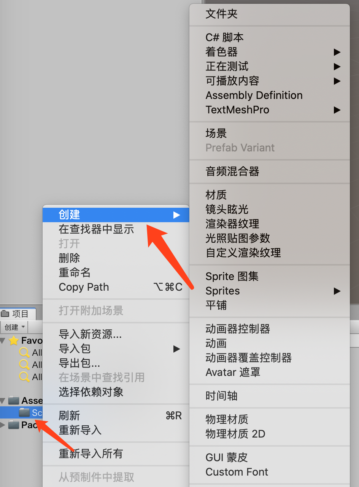

# Unity 基础

### Unity 界面

#### 布局

* Window>Layouts>Default Layout恢复默认布局
* Window>Layouts>Save Layout保存当前布局

#### 视图管理

鼠标悬浮在检查器上方，右键可以看到添加选项卡选项，可以按照需要添加删除视图。

#### 项目视图Project

**资源**

所有的纹理、网格、声音文件、脚本都可以称为资源

> 在Unity内部移动管理资源，不要在Unity外部操作

**添加资源**

如果想要添加资源，在Assets下右键，创建选择需要的资源即可

**Favorites**

可以快速选择某种类型的全部资源。

#### 层级Hierarchy

和Project视图很类似，一个是资源库，一个是项目库。

首次使用Unity会创建一个默认场景，包含MainCamera和Directional Light。

> 当你创建一个Untiy项目后，第一件事是在Project的Assets文件夹下创建一个Scenes的文件夹，把所有的场景或者关卡放在相同的位置。

#### 检查器Inspector

Inspector视图可以让你查看当前选中的对象的全部属性。

* 如果勾选对象名称旁边的复选框，就会禁用这个对象
* 下拉列表：从一组预先定义的选项中选择合适的选项
  * Layer：图层
  * Tag：标签
* 文本框、下拉菜单和滑动条可以更改他们的值
* 每个游戏对象就像是不同的组件的容器，可以通通过取消选中这些组件禁用这些组件。
* 点击Add Component添加组件可以添加组件

#### Scene 视图

* 绘制模式（Draw Mode）：默认是Shaded（阴影），意思是说所有的对象将利用他们的纹理绘制。
* 2D/3D视图
* 场景光照（Scene Lighting）：确定对象用默认环境光（Ambient Lighting）还是用场景内的光照
* 试听模式（Audition Mode）：用于设置Scene视图中音频源功能
* 游戏叠层（Game Overlay）：用于控制场景视图中的天空盒、雾效等其他效果是否显示
* 小工具选择器（Gizmo Selector）：帮助可视化调试，控制你的当前朝向，并能让场景视图与某个轴对齐

#### Game视图

Game视图可以实时预览制作中的游戏，Game视图带有一些控件，可以帮助我们测试游戏。

* 播放
* 暂停
* 步进
* 分辨率菜单
* 最大化播放（Maximize on Play）
* 静音（Mute audio）
* Gizmos：用于确定游戏正在运行时是否显示小工具

#### 工具条

* 变换工具（Transform Tool）：可以操纵游戏对象
* 变换小工具（Gizmo）切换开关：可以控制小工具如何显示在Scene视图中
* Game视图空间（Game View Control）
* 账户和服务（Account and Service）：管理Unity账户
* 图层下拉菜单（Layers Drop-down）：用于决定哪些对象图层将出现在Scene视图中。
* 布局下拉菜单（Layout Drop-down）：这个菜单允许快速更改编辑器布局

### 在Unity场景视图中的导航

#### Flythrough模式

按住鼠标右键移动即可，可以按照第一人称模式在场景中移动

* 鼠标：让摄像机转动
* WASD：前左后右移动
* QW：上下移动
* 按住shift按住上述按键：加速移动

### 快捷键 for Mac

* 两只手指头放大：全屏场景
* 在场景Command+N：新建场景

