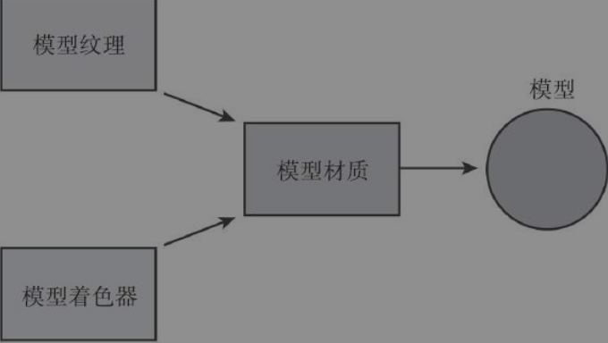

# 模型、材质、纹理

## 模型的基础知识

在2D游戏中，图形有称为精灵（Sprite）的平面图像组成。

3D游戏中的对象是由网格组成的，这些网格也就是三角形，彼此相连组成形状，最后构成复杂的图形。其实就是3D模型。

基本元素为什么是三角形，而不是矩形之类的呢？

> * 当有了一个三角形的情况下，只需要在添加另一个顶点，就可以创建一个新的三角形。
> * 通过使用三角形形成的形状，可以对任何3D对象进行建模。

注意：模型（model）还是网格（mesh）

> 网格包含定义3D对象的形状的顶点信息。而模型是网格的对象。

### 内置3D对象

Unity内置了基本的3D对象

### 导入模型

只需要将包含3D模型的文件放入Assets文件夹中就导入成功了。

**Unity支持：**.fbx、.dae、.3ds、.dxf、.obj

导入的模型拖入到场景上就可以显示。导入模型包含：

* 网格过滤器
* 网格渲染器

这两个组件可以让模型显示在屏幕上。

### 模型和Asset Store

Ps:不要是用公司网络，太卡了

## 纹理、着色器和材质

图形资源：纹理、着色器和材质

* 纹理：Textures
* 着色器：材质是纹理和着色器之间的接口，材质告诉纹理着色器需要什么资源。（类似于描述文件）
* 材质：Materials应用于模型的着色器和纹理的容器

