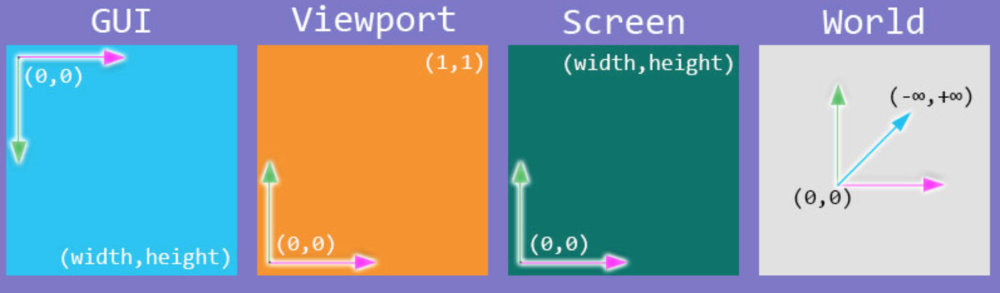
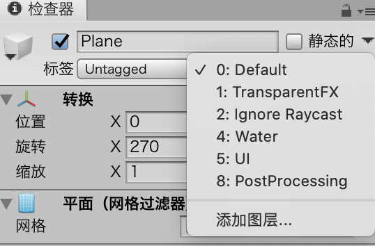
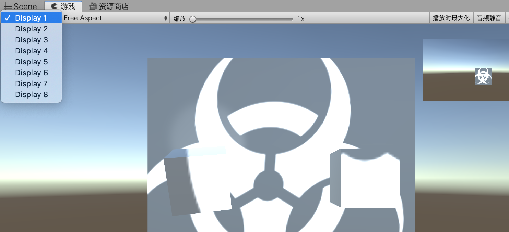
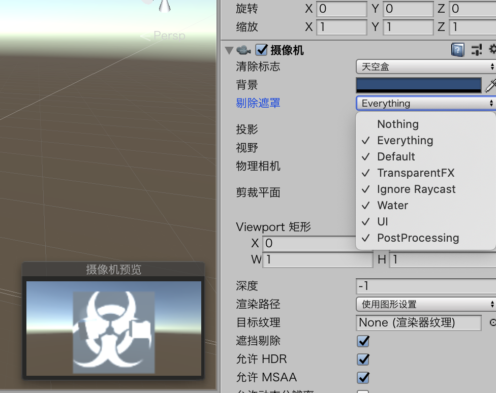

# 灯光和摄像机

大多数想要实现逼真效果的场景都会需求至少一种灯光。

## 灯光

### 烘焙灯光和实时灯光

电脑计算灯光需要散步：

* 通过光源计算灯光的颜色、方向和范围
* 当光线找到游戏对象的表面时，会照亮游戏对象的表面，并改变游戏对象的颜色
* 计算灯光与游戏对象表面的碰撞角，之后灯光会发生散射。Loop步骤一和步骤二

烘焙（Baking）指的是完全提前计算纹理和对象的光照以及阴影。

### 点光源

点光源类似于灯泡。

* 创建平面，GameObjec>3D Object>Plane位置（0，0.5，0），旋转到（270，0，0）摄像机可以看到
* 添加两个立方体（-1.5，1，-5）（1.5，1，-5）
* 创建>灯光>点光源 （0，1，-7）
* 将灯光的阴影类型设置为Hard Shadow

硬阴影和软阴影的区别，类似于阴影边缘是模糊还是明显。

### 聚光灯

聚光灯将照亮他们前面的对象，二其他对象依旧处于黑暗之中。

可以直接修改其他灯光的类型，比如上边的点光源修改类型即可。

### 定向光

类似于太阳，可以照亮整个场景。也可以通过修改灯光类型完成。

### 利用对象创建灯光

场景中的任何对象都可以是灯光

* Add Component>Rendering>Light

* Component>Rendering>Light

### 光晕

光晕是在雾天或者阴雨条件下出现在灯光周围的发光圆环。

每种灯光都有Draw Halo的复选框，勾选即可。

### Cookie

Cookie是一种特殊纹理，可以添加到灯光中，是的阴影可以显示特殊形状。

* 创建一个场景，删除场景中的自带定向光
* 向场景中添加一个平面，把他定位于（0，1，1）处，并把旋转方式设置为（270，0，0）
* 首先选中Main Camera，然后给他添加灯光，使用Component>Rendering>Light命令，把灯光类型更改为Spot。把范围设置为18，把聚光角度设置为40，并把强度设置为3
* 把biohazard.png纹理从本书配套资源中拖到Project视图中。选中该纹理，然后在Inspector视图中把纹理的类型改为Cookie（剪影）。将灯光类型设置为Spotlight，将alpha源设置为From GrayScale。这样就可以样Cookie在黑色的地方阻挡灯光。
* 选中Main Camera，单机并把biohazard纹理拖到的灯光组件的Cookie属性中，就会看到biohazard图标投射到了平面上。
* 常识各种灯光范围和强度参数。旋转平面查看标志如何变幻，扭曲。

## 摄像机

摄像机是玩家观察游戏世界的视野。

### 摄像机介绍

摄像机有很多属性，但是基本设置好之后就不用动了。

* Flare Layer允许摄像机查看灯光的镜头光晕
* 音频侦听器允许摄像头接收声音

> 如果场景中有多个音频侦听器需要删除多余的侦听器

### 多个摄像机

可以添加多个摄像机完成场景调度。

GameObject>Camera

也可以在对象上添加摄像机

Add Component>Rendering>Camera

### 屏幕分拆和画中画

这个视口（View Port）左下角是（0，0）右上角是（1，1）。

添加两个摄像机，通过设置他们的视窗宽和高导致运行时产生两个画面。

Unity中的坐标系

1. 世界坐标系 (World Space)
2. 屏幕坐标系 (Screen Space)
3. 视口坐标系 (Viewport Space)
4. GUI界面坐标系 (GUI System)

## 图层

当一个项目过多或者对象过多，就需要图层来管理。默认情况下有8个内置图层和24个自定义图层。

### 图层介绍

每个游戏对象初始都在Default图层当中。

* Default
* TransparentFX
* IgnoreRaycast
* Water
* UI

### 使用图层

* 在Scene视图中隐藏他们

* 排除不被灯光照亮的对象
* 告诉Unity哪些对象之间可以进行物理交互
* 使用他们自定义摄像机可以看到什么或者看不到什么

## 其他

* 设么时候使用透视或者正交摄像机：3D透视
* 照亮整个场景：定向光
* 你可以创建多少个用户自定义图层：24个
* 什么属性决定了那些图层将被灯光和摄像机忽略：Culling Mask属性

