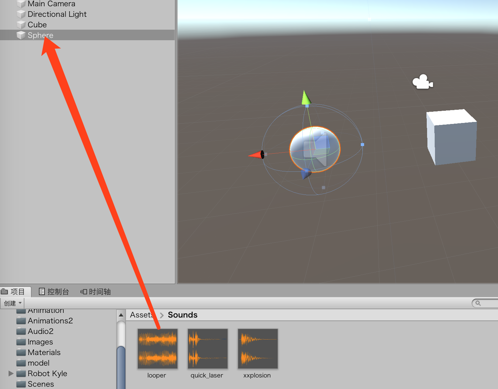
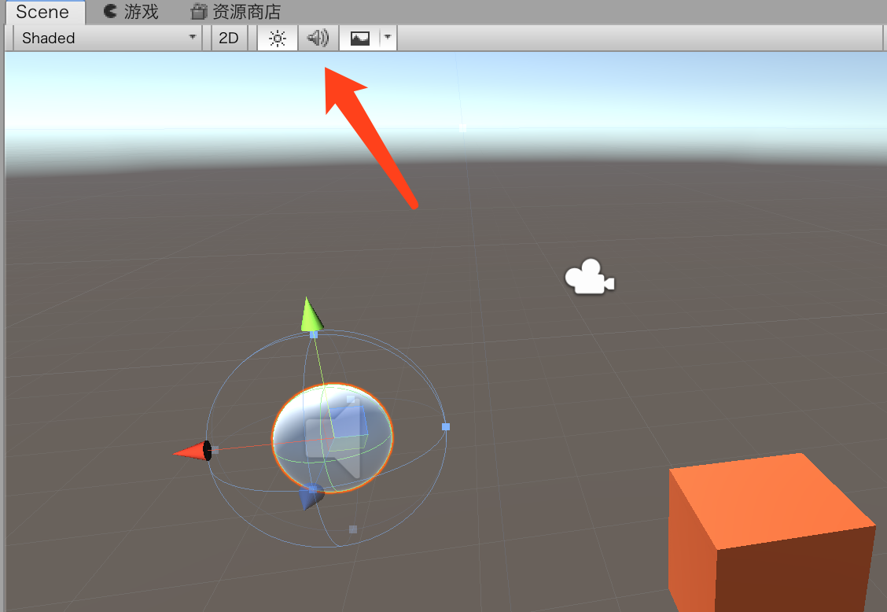

# 音频

## 基础知识

### 组成部分

为了让音频能在场景中正常工作，需要3个组件：音频侦听器（Audio Listener）、音频源（Audio Source）和音频剪辑（Audio Clip）。

把音频侦听器放在代表玩家的游戏对象上是一种常见的操作。如果把音频侦听器放在任何其他游戏对象上，记得需要从Main Camera上移除它。每个场景中只允许存在一个音频侦听器。

### 2D和3D音频

2D声音最适用于菜单、警告、声道或者总是需要以完全相同的方式被收听的音频。

3D音频解决了2D音频的问题。这些音频剪辑具有衰减（Rolloff）功能，这个功能的意思是：音频侦听器会根据与音频源的远近，从而让声音变得更小或更大。在复杂的音频系统中，比如Unity中的音频系统，3D声音甚至可以有一种模拟的Doppler效果

## 音频源

### 导入音频剪辑

要给游戏对象添加音频源，可以选择想要添加音频源的对象，然后使用**Add Component>Audio>AudioSource**命令。

* 创建一个新项目或者场景。在随书资源的Hours 21中找到Sounds文件夹，然后拖到Unity的Project视图中完成导入操作。
* 在场景中创建一个立方体，然后将它的位置摆放在（0,0,0）。
* 在立方体上添加一个音频源（选中AddComponent>Audio>Audio Source）
* 在新导入的Sounds文件夹中找到looper.ogg文件，然后将它拖动到立方体音频源的Audio Clip属性上

* 确保勾选了Play On Awake属性，然后运行场景。注意音频正在播放，它应该在20秒之后停止播放（除非设置了循环播放）。

### 在Scene视图中测试声音

要在Scene视图中测试音频，需要打开场景音频，点击场景音频切换开关。当开启这个开关后，场景会使用假想的音频侦听器，这个侦听器位于Scene视图当前帧的引用上（而不是位于实际的音频侦听器组件所在的位置）。

### 3D音频

如前所述，默认情况下所有的音频都是2D音频。我们可以很轻松地将2D音频转换为3D音频，只需要将SpatialBlend Slider的值设置为1。

## 音频脚本

如果想在创建了声音源一段时间之后再播放声音，或者想从相同的声音源中播放不同的声音，那么这个时候就需要声音脚本了。

* 打开在上一个“动手做”练习中创建的场景。
* 在之前创建的Cube游戏对象上，找到Audio Source组件。不要勾选Play On Wake属性，但是要勾选Loop属性。
* 创建一个名为Scripts的新文件夹，然后创建一个名为AudioScript的新脚本。将这个脚本添加到立方体上。
* 运行场景。按下空格键就可以开始或者停止音频播放。注意当你播放音频的时候，音频剪辑总是从头开始播放。

## 音频混频器

audiomixers（音频混频器）是一种用于混合舞台效果的资源类型，当需要平衡音频的时候可以提供精准的控制。

