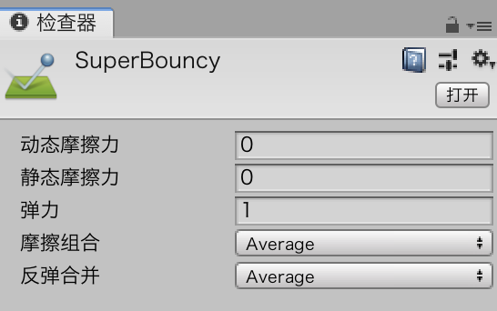
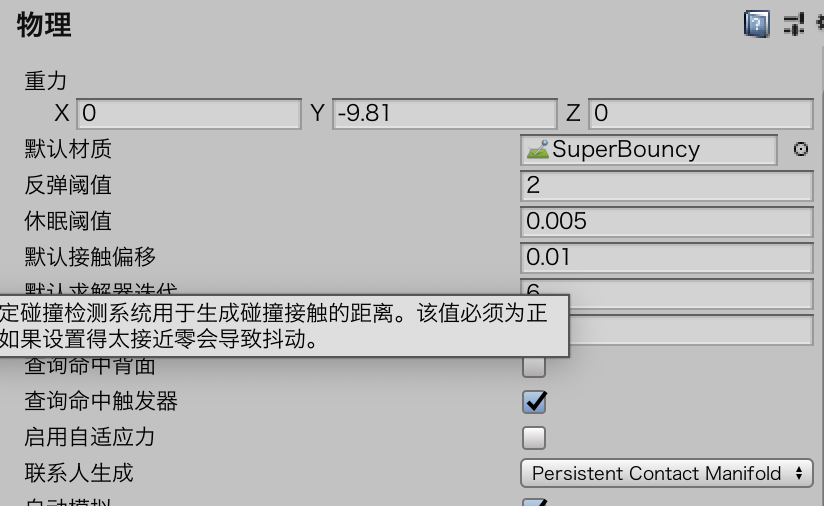

# Chaos Ball

## 设计

### 规则

* 当四个球都位于正确的角落时玩家获胜，没有输掉游戏的情况
* 当球集中正确的角落，球会消失，同时那个角落的颜色会变暗
* 游戏中的所有对象都有弹性，他们不会应为碰撞而损失动量
* 任何球都不能离开竞技场

### 需求

* 带有墙的竞技场
* 用于竞技场和游戏对象的纹理，Unity标准资源有
* 多个彩球和混乱球
* 一个角色控制器
* 一个游戏控制器
* 一种有弹性的物理材质
* 彩色的角落指示器
* 交互式脚本

## 竞技场

### 创建竞技场 arena

* 创建一个名为Chaos Ball的新项目。
* 点击Assets>Import Package，然后选择Characters和Environment包。
* 将一个平板添加到场景中（GameObject>3D>Plane），将这块平板放在（0，0，0）的位置，然后将缩放比例设置为（5，1，5）。
* 删除Main Camera。
* 在场景中添加一个立方体，将立方体放在（–25，15，0）的位置，然后将它的缩放比例设置为（1.5，3，51）。注意它会成为竞技场的围墙。将这个立方体命名为Wall1。
* 将这个场景保存为Scene文件夹的Main场景。

> 多个对象可以使用复制获得，而不用每次都需要重新设置

### 纹理化

添加一些纹理

* 在Project视图中的Assets下面创建一个名为Materials的新文件夹。向该文件夹中添加一种材质（右键点击文件夹，然后选择Create>Material命令），把该材质命名为Wall。
* 在Inspector视图中，为Wall材质应用Sand Albedo纹理，我们可以将材质拖动到Albedo属性上，也可以点击Inspector视图中单词Albedo旁边的圆形选择器。
* 拖动Smoothness滑动器将它的值设置为0。
* 将x轴的Tilting属性设置为0。
* 在Scene视图中，点击并拖动墙材质到墙对象上。

修改地板

* 在Project视图中，找到StandardAssets\Environment\Water\Water4\Prefabs这个文件夹，将Water4Advanced这个资源拖动到场景中。
* 将水材质放在中心（0,0.5,0）的位置。

### 创建超级弹性材质

* 右键单击Materials文件夹，然后使用Create>PhysicMaterial命令。把新材质命名为SuperBouncy。
* 设置超级弹性材质的属性。一般来说，你想要球体有100%的弹性，所以它们的移动速度应该保持一致。

需要将这个材质应用于所有的碰撞体。

* 选择Edit>Project Settings>Physics命令，会在Inspector视图中打开Physics Manager菜单
* 将Default Material属性设置为SuperBouncy材质

### 完成剩余工作

复制围墙（在Hierarchy视图中选择围墙，然后右键选择Duplicate命令）

* 复制围墙一次，将新实例的坐标设置为（25,1.5，0）。
* 再复制一次，将它放在（0,1.5,25）的位置，旋转角度设置为（0,90,0）。
* 复制第二步创建的新实例（因为它已经旋转过了），将它放在（0,1.5,-25）的位置。
* 创建一个名为Walls的空游戏对象，位置设置为（0,0,0）。将上面的四面围墙都放在这个游戏对象下面。现在竞技场有了四面围墙，围墙之间没有任何间隙

## 游戏实体

### 玩家

* 将FPSController角色控制器拖到场景中，这个资源的目录是：Assets\Characters\FirstPersonCharacter\Prefabs。
* 将控制器放在（0,1,0）的位置。
* 在Hierarchy视图中展开FPSController对象，然后找到FirstPersonCharacter子对象（这个对象上面带有一个摄像机）。
* 将FirstPersonCharacter放在（0,5,–3.5）的位置，旋转角度设置为（43，0,0）。现在摄像机应该在角色的肩后，有一点俯视的感觉。

添加一个缓冲器，应该是一个平面，角色要用它来弹球。

* 在场景中添加一个立方体，将这个立方体重命名为Bumper，将缓冲器的缩放大小设置为（3.5，3,1）。
* 在Hierarchy视图中，单击缓冲器，然后把它拖到FPSController对象，将缓冲器嵌套在控制器上。
* 然后，将缓冲器的位置设置为(0，0，1)，旋转角度设置为(0，0，0)。缓冲器现在将稍稍位于控制器的前面。
* 我们创建一种新材质（非物理材质）BumperColor，给缓冲器添加一点颜色。将材质的Albedo color设置为你喜欢的颜色，然后将它拖动到缓冲器上。

### 混乱球

* 在场景中添加一个球体，将球体命名为Chaos，然后将它放置在（12,2,12）的位置，缩放比例设置为（0.5,0.5,0.5）。
* 为混乱球创建一种新材质（非物理材质），把它命名为ChaosBall。然后将颜色设置为亮黄色，单击并把材质拖到球体上。
* 为球体添加一个刚体，不要勾选UseGravity。将Collision Detection属性设置为ContinuousDynamic。在Constraints属性下面，冻结y轴，因为我们不想让球体上下浮动。
* 打开Tag Manager（使用Edit>ProjectSettings>Tags&Layers命令），然后单击Tags旁边的箭头展开Tags区域，然后添加一个新Tag：Chaos。然后再添加四个新Tag：Green、Orange、Red和Blue，后面我们会用到它们。
* 选中Chaos球体，然后在Inspector视图中把它的Tag设置为Chaos

现在球体已经制作完成，但它还不会动。你需要创建一个脚本，让球体在竞技场中四处移动。在这个例子中，你需要创建一个名为VelocityScript的脚本，然后将它添加到混乱球上。

在Hierarchy视图中，新复制出三个混乱球，将混乱球分散在竞技场中，确保只更改混乱球的x轴和y轴的位置，然后给y轴一个随机旋转值。

创建一个名为Chaos Ball的空对象，将它放在（0,0,0）处，然后将所有的混乱球都放在它下面，保持Hierarchy视图的结构整洁。

### 彩球

* 在场景中添加一个球体，然后将它重命名为Blue Ball。将这个球体放在竞技场靠近中心的某个位置，然后确保y值为2。
* 创建一个名为BlueBall的新材质，将颜色设置为蓝色，设置方法与将混乱球设置为黄色是一样的。完成这步之后，再制作一个RedBall、GreenBall、OrangeBall材质，然后将每种材质都设置上对应的颜色。点击并拖曳BlueBall材质到对应的球体上。
* 在球体上添加一个刚体，不要勾选Use Gravity，将碰撞检测设置为Continuous Dynamic，然后在Constraints下冻结y轴。
* 之前，我们已经创建了Blue Tag，现在将球体的tag设置为Blue，设置方式请参考混乱球的设置方式
* 将速度脚本添加到球体上，在Inspector视图中，找到Velocity Script(Script)组件，同时将Start Speed属性设置为25。这样在开始的时候，彩球的运动速度要小于Chaos Ball的运动速度。

现在需要创建另外三个彩球，每个彩球都从蓝色复制。

## 控制对象

### 球门

* 创建一个空游戏对象（使用GameObject>CreateEmpty命令）。将这个游戏对象重命名为Blue Goal，然后将它的标签设置为Blue。最后把游戏对象的位置设定在（–22,2,–22）。
* 给球门添加一个盒子碰撞体，勾选Is Trigger属性。将盒子碰撞体的大小设置为(3，2，3)。
* 把一束灯光添加到球门上（使用Component>Rendering>Light命令）。把灯光设置为点光源，让它的颜色与球门相同（见图10-9）。然后将灯光的强度改为3，Indirect Multiplier设置为0。

复制其他三个球门。

### Game Manager

* 向场景中添加一个空的游戏对象，把它移到某个不碍事的位置，重命名为Game Manager。
* 创建一个名为GameManager的脚本，然后把代码添加到脚本中。然后把这个脚本添加到游戏控制器上。
* 选中游戏控制器，把每个球门都拖到Game Manager脚本组件中与它们对应的属性上

## 其他

* Continous Dynamic这种碰撞检测的确会降低性能。不过，在这个游戏案例中，我们需要这样做。混乱球比较小且速度快，如果不这样做它们可能会穿过墙壁。

