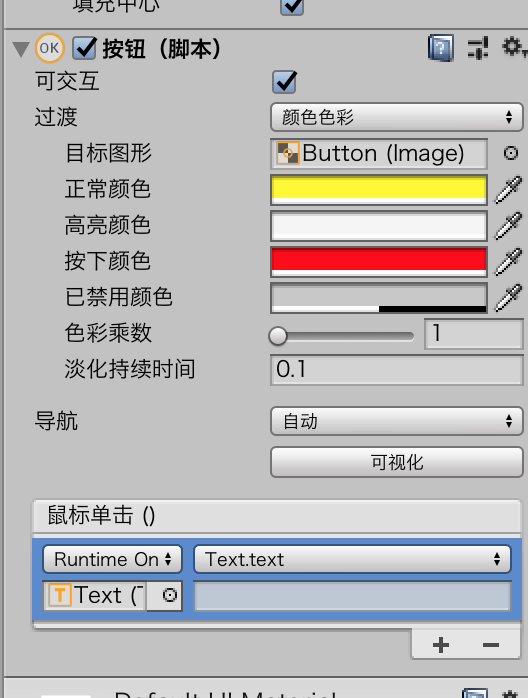
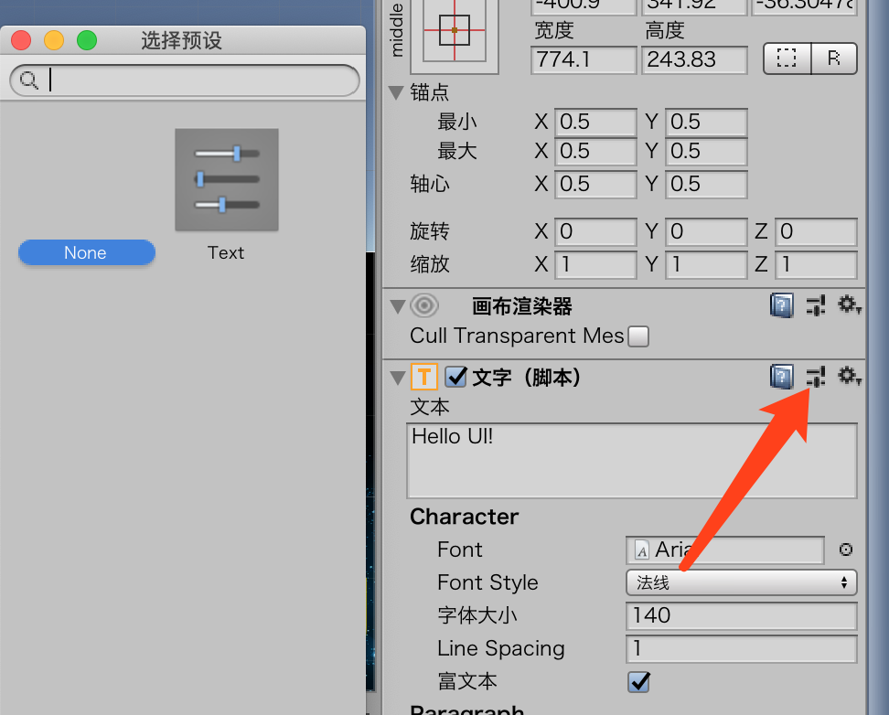
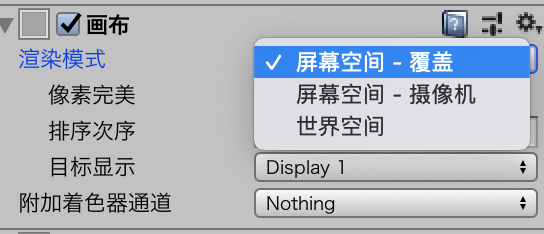
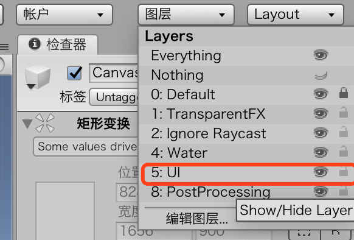

# 用户界面

用户界面（User Interface，UI）是一组特殊的组件。

##  UI的基本原则

在Unity中，UI基于画布（Canvas）创建。

## 画布

画布是UI的基石，所有的UI都在画布中。

```
GameObject>UI>Canvas
```

* 创建一个新项目（2D或者3D都可以）。
* 在场景中添加一个UI画布（使用GameObject>Ui>Canvas命令）。
* 缩小画布（双击Hierarchy视图中的画布），观察画布的全貌。注意它的大小。
* 注意Inspector中画布奇怪的变换组件（TransformComponent）。它是一个Rect交换，后面我们会简单介绍。

> 可能你已经注意到了，当你在场景中添加一个画布的时候，还会添加一个EventSystem游戏对象。这个对象总是随着画布一起添加到游戏场景中。事件系统允许用户通过按下按钮或者拖动元素来与UI进行交互。除了事件系统，没有其他对象知道UI是否被调用，所以不要删除这个对象。

性能：

> UI的任何一部分发生变化的时候都要重新构建。这是一个缓慢而又低效的过程，可能导致游戏中明显的卡顿。因此，最好使用画布组件来将对象分开，将总是变化的UI对象放到单独的画布中，这样当它们发生变化的时候，只会让部分UI重新绘制，就可以大大提高效率。

### Rect Transform

> 前面创建的画布，它的Rect Transform是灰色的。这是因为，在当前的状态下，画布继承了Game视图的数值（也就是游戏所运行的设备的分辨率和长宽比），这也就意味着画布总是占据了整个界面

### 锚点

锚点有两个模式：together和split

* together：游戏对象通过距离锚点的距离来确定自身位置
* split：UI的大小基于它的边框的每个角到split锚点每个角的距离

实例

* 创建一个新场景或者项目。
* 添加一张UI图片（使用GameObject>UI>Image命令）。注意，如果向没有画布的场景中添加一张图片，Unity会在场景中自动添加一个画布，然后将图片放在上面。
* 执行放大操作，直到可以看清整张图片和画布。注意，场景在2D模式（点击Scene视图顶部的2D按钮）下更容易处理UI相关的操作，也更便于使用Rect工具（快捷键：T）。
* 在画布上拖动图片，也尝试一下在画布上拖动锚点。注意观察图片的轴心距离锚点有多远。同时还要注意观察，当你在画布上拖动图片或者锚点的时候，Inspector视图中Rect transform的属性变化。
* 现在，让我们更改锚点的模式。拖动锚点的任意一角，让它与其他角分开，当锚点处于split模式的时候，再次移动图片。注意观察Rect Transform的属性更改。（注意：Pos X，Pos Y,Width,Height这些属性都去哪里了？）


### 其他Canvas组件

Canvas Scaler组件允许你指定UI元素的大小和在不同目标设备上的变化方式。


## UI元素

### 图片

* 创建一个新场景或项目。
* 将BackgroundSpace.png导入项目，确保是按照精灵的方式导入（如果不记得怎么操作，请参考第12章的内容）。
* 在场景中添加一张图片（使用GameObject>UI>Image命令）。
* 将图片BackgroundSpace设置到图片对象的SourceImage属性上。
* 重新调整图片的大小让它填充整个画布。切换Game视图，查看当高宽比发生变化的时候图片会发生什么变化。你会发现图片可能被切断或者超出屏幕范围。
* 拆分图片的锚点，让四个锚点分别处于画布的四个角落。现在切换到Game视图，查看当高宽比发生变化的时候，图片会有什么变化。你会发现：图片总是会填充整个屏幕而不会被截断——虽然图片可能会被拉伸。

> UI材质：UI下Material是一个可选属性，也可以没有


### 文本

```
GameObject>UI>Text
```

### 按钮

```
GameObject>UI>Button
```

* 创建一个新项目或者新场景。
* 在场景中添加一个按钮（使用GameObject>UI>Button命令）。
* 在Inspector的Button（Script）组件下，将Highlighted Color设置为红色，然后将Pressed Color设置为绿色。
* 在Inspector视图中，点击底部的+号添加一个新的On Click()事件。现在这个事件处理器开始查找要操作的对象，默认值是None。
* 在Hierarchy视图中展开按钮对应的游戏对象，查看Text子对象。将Text对象拖动到事件处理器的Object属性上。
* 在下拉菜单中（默认值是No Function），指定要对选定的对象执行的函数。点击下拉框，然后选择Text（#2）>string text（#3）。



* 在输入框中输入Released。
* 运行游戏，用鼠标划过按钮，按下按钮不动，然后再释放按钮。注意在这个过程中的颜色和文本的变化。

> 排序方式和2D游戏一样，控制Hierarchy顺序即可

### Presets



一个常见的应用场景就是，想要游戏中所有的文字都有相同的设置，可能你不想将所有的文本都制作成prefab，所以现在只需要在文本上应用preset就能快速地保持文本属性的统一。


## 画布的渲染方式

Unity提供了三种强大的选项控制UI显示在屏幕上的方式。

在Hierarchy中选中Canvas，然后在Render Mode中就可以选择想要使用的模式。



### Screen Space-Overlay

Screen Space-Overlay是默认的渲染模式，它是最易于使用且最强大的画布渲染模式。处于Screen Space-Overlay模式的UI将会绘制在屏幕的最顶层，而不管游戏世界中摄像机的设置或者摄像机的位置。

可以通过Layer隐藏UI面板




### Screen Space-Camera

Screen Space-Camera模式与Screen Space-Overlay模式类似，但是这个模式下UI渲染使用你选择的摄像机。你可以旋转或者缩放UI元素来获取丰富的动态3D界面。


### World Space

最后我们要介绍的是World Space模式。想象一个虚拟博物馆，你参观的每个展品旁边都有一个详细介绍的面板，上面有一个按钮，点击后可以查看更多信息或者跳转到其他展品。如果能想像出这个场景，就能大概理解WorldSpace模式的使用。


## 其他

* 一个场景中可以有多个画布
* Unity的UI通常带有Canvas和EventSystem
* 玩家头顶的问号，使用的事World Space模式

