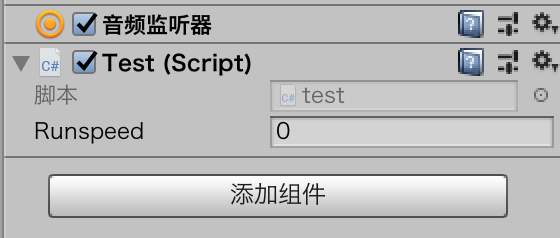

# 脚本上

C#基本概念

## 脚本

* 创建脚本
* 将脚本添加到一个或者多个游戏对象上
* 如果脚本需要，就用值或者其他游戏对象填充脚本的属性值

### 创建脚本

如果脚本中包含一个名为MyAwesomeClass的类，那么脚本的名字必须是MyAwesomeClass.cs

### 添加脚本

拖动到指定对象上即可

### 分析脚本的基本内容

* using
* 类声明
* 类内容

### using部分

脚本使用的库。

### 类声明部分

类声明（Class Declaration）

### 类内容

场景第一次启动的时候会运行Start方法中的代码。

每次游戏更新的时候，会运行Update方法（有时候一秒钟运行上百次）

## 变量

### 创建变量

变量（Variable）

int num1;

### 变量作用域

局部变量和全局变量

### 公共和私有

访问修饰符（access modifier）

* 公共 public：对于其他脚本是可见的
* 私有 private：只能在文件内部使用

添加的公共变量可以在挂载的对象上查看及修改。

## 运算符

### 算术运算符

和其他语言一致，从左到右，括号优先，乘法和除法次之。

### 赋值运算符

* =
* =+、-=
* ++、--

### 相等运算符

* ==
* </>
* ！=

### 逻辑运算符

* &&
* ||

## 条件

### if语句

if(){}

### if/else语句

if(){

}else{

}

### if/else if语句

if(){

}else if(){

}

## 迭代

### while

while(){

}

### for

for(int count = 1;count<=10;count++){

}