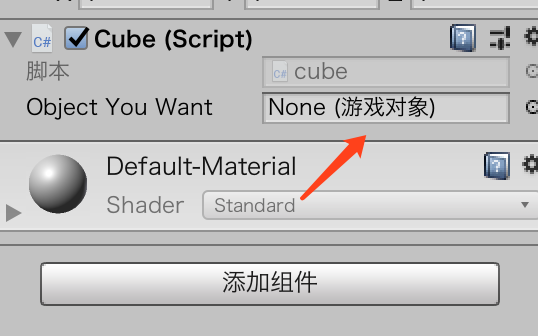

# 脚本下

## 方法

方法也称函数function，是可以独立调用的代码模块。


返回int类型方法

int TakeDamage(int dagameAmount){

​	int health = 100;

​	return health - damageAmount;

}

无返回值方法

Void MyMethod(){

}	


## 输入

### 输入的基础知识

Unity提供了一个简单的系统可以控制输入映射。

Edit>Project Settings>Input 打开Input Manager可以添加不同的轴。

### 输入脚本

* 创建一个新项目或场景，在项目中添加一个名为PlayerInput的脚本，然后把它添加到Main Camera上。
* 把以下代码添加到PlayerInput脚本中的Update方法中：

        float h = Input.GetAxis("Horizontal");
        float v = Input.GetAxis("Vertical");
    
        if (h != 0)
        {
            print("h:"+h);
        }
        if(v != 0)
        {
            print("v:"+v);
        }
这段代码必须在Update函数中，因为它每一帧都要检查用户输入。

* 保存脚本然后运行场景，注意按下箭头键时Console中的输出。现在试试按下W、A、S和D键。如果没有看到任何输出，请用鼠标点击Game窗口[插图]，然后再重复操作一遍。


### 特定键的输入

* 创建一个新项目或场景，在项目中添加一个名为PlayerInput的脚本，然后把它添加到Main Camera上。
* 在PlayerInput脚本的Update方法中添加如下代码

        if (Input.GetKey(KeyCode.K))
        {
            print("k down");
        }
        if (Input.GetKey(KeyCode.O))
        {
            print("o down");
        }
* 保存脚本并运行场景。注意当按下M键时与按下O键时有什么不同。当按下M键的时候，只要没有松开，Console中就会一直打印“The‘M’was presseddown”，而按


### 鼠标输入

* 创建一个新项目或场景，添加一个名为PlayerInput的脚本，然后把它添加到Main Camera上。
* 把以下代码添加到PlayerInput脚本的Update方法中

        float x = Input.GetAxis("Mouse X");
        float y = Input.GetAxis("Mouse Y");
    
        if (x != 0)
        {
            print("x:" + x);
        }
        if (y != 0)
        {
            print("y:" + y);
        }
* 保存脚本并运行场景。仔细观察Console，看看移动鼠标时的输出。


## 访问局部组件

### 使用GetComponent

在运行时可以通过脚本与组件进行交互。需要得到想要操作的对象的引用（reference），GetComponent<Type>()方法需要通过尖括号指明想要查找的组件，比如Light、Camera等脚本类型。

GetComponent()返回对象第一个指定类型的组件。

    Light lightComponent;
    
    // Start is called before the first frame update
    void Start()
    {
        lightComponent = GetComponent<Light>();
        lightComponent.type = LightType.Directional;
    }


### 访问Transform

通过Transorm可以修改组件的属性，可以让游戏对象在屏幕上移动。平移Translate()、旋转Rotate()、缩放localScale。

* 创建场景，添加立方体（0，-1，0）

* 创建CubeScript脚本，添加到立方体上，修改update

  ```c#
      transform.Translate(0.5f, 0f, 0f);
  
      transform.Rotate(0f, 0f, 1f);
  
      transform.localScale = new Vector3(1.5f, 1.5f, 1.5f);
  ```
* 保存脚本运行。

> 注意，Translate()和Rotate()函数的效果会累加，但是localScale不会。


## 访问其他对象

### 寻找其他对象

两种方式查找其他对象。

* 在脚本中创建一个GameObject实例

```
public GameObject objectYouWant;
```

* 然后将这个脚本拖到一个对象上，然后可以在Inspector看到



* 这时候只需要将想要控制的组件拖入到上图箭头位置即可

还有一种方法是使用Find方法。脚本中有三种主要的查找方式：使用名称、使用标签、使用类型。

```
private GameObject target;
void Start(){
	target = GameObject.Find("Cube");
}
```

> 注意：Find()方法的速度特别慢，因为需要遍历场景中的所有对象，直到找到匹配的对象。所以，尽可能的避免使用这个方法。

还可以使用Tag查找

```
target = GameObject.FindWithTag("MyNewTag");
```


### 修改对象组件

和之前修改一个组件一样，只不过之前是直接操作，但是现在需要先声明一个变量，然后通过变量操作组件。


## 其他

* 每个方法都有返回类型，如果方法不返回任何内容，类型就是void
* 玩家交互映射到轴，这样后需调整的时候就会更加方便


